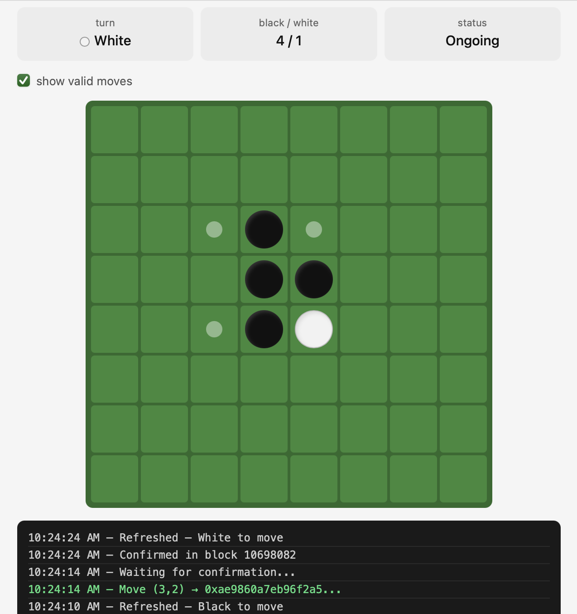

# Othello Smart Contract

Created by Nick Derby & Jeremy Varghese

This repository contains a Solidity smart contract that allows two players to play Othello, also known as Reversi. Once the contract is deployed on chain, players can interact directly with the game using the UI contained in the file `othello.html`. A sample game in progress is shown below:



## Deployment Instructions

Before deploying, note that with the current configuration of our smart contract, you should NEVER use public/private keys for accounts that contain valuable assets. Only use accounts with testnet tokens.

To deploy our Othello Smart Contract, first build and compile the files by running `forge build`. Then, get the public addresses for Player Black and Player White. Store these addresses as environment variables like so:

```sh
export PLAYER_BLACK=<player black public address>
export PLAYER_WHITE=<player white public address>
```

Then, run the following command to deploy the smart contract to the chain:

```sh
forge script Deploy \
--rpc-url <rpc url> \
--private-key <your private key> \
--broadcast
```

Upon running this command, you will be provided with the contract address, which is crucial to accessing the game in the UI.

Next, serve the UI locally. In our experience, using `python3 -m http.server 8080` works well for this purpose. Navigate to [http://localhost:8080/othello.html](http://localhost:8080/othello.html) in your browser to open the UI. Lastly, enter the RPC URL, contract address, and your private key as either player black or player white. This will allow you to make moves as the corresponding player.

## Testing

This repository also contains a full testing suite to verify all of the contract functions. To run these tests, simply run `forge build` followed by `forge test`. Run `forge test -vv` to view printed outputs of the game board in the console.
